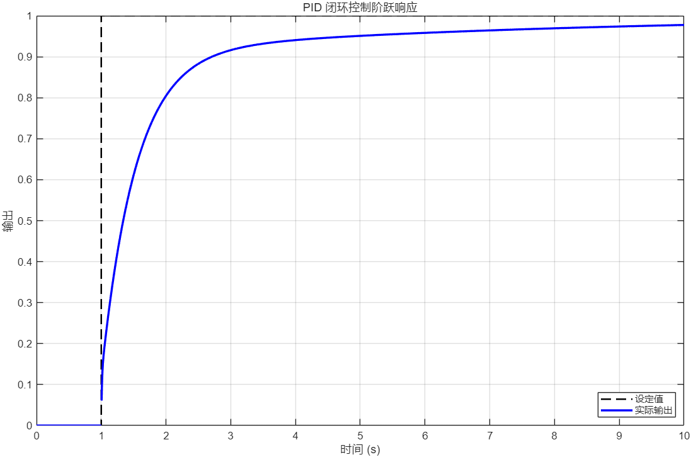
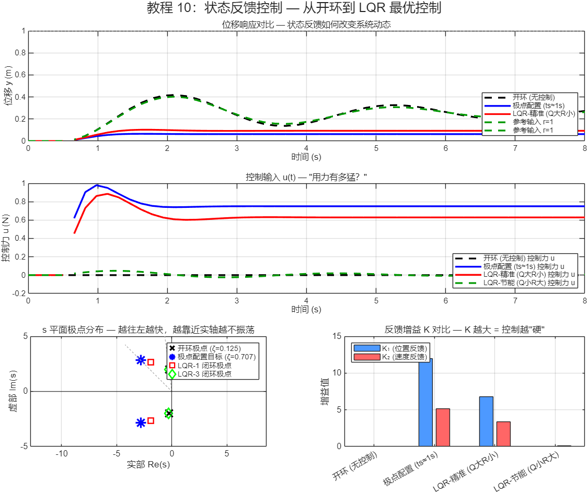
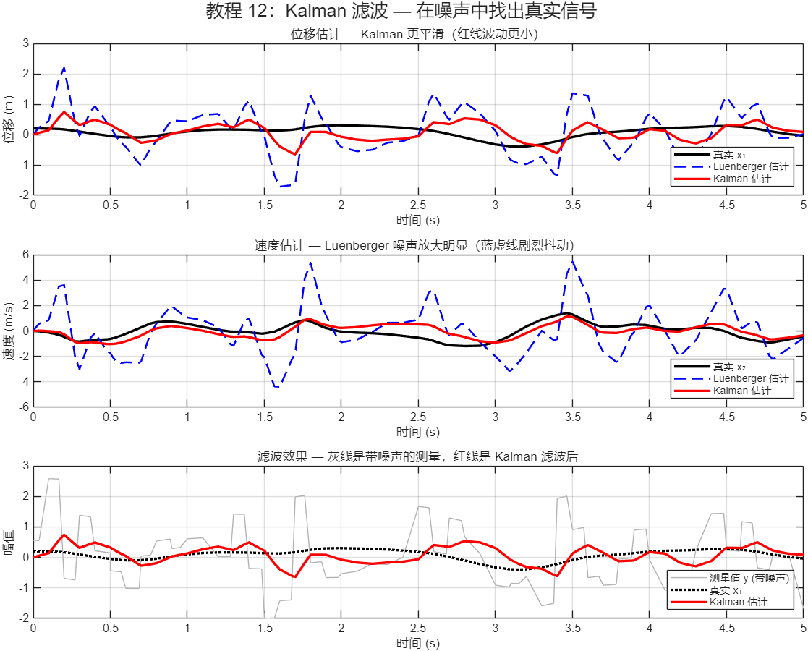
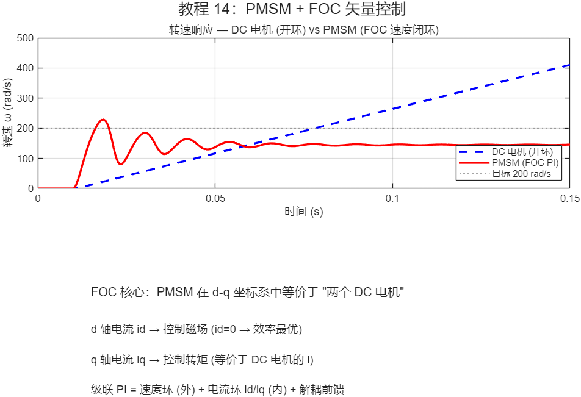

<p align="center">
  
  
  
  
  
  
  
</p>

<h1 align="center">Simulink 控制工程教程</h1>
<p align="center">
  <strong>从零基础到嵌入式代码部署 — 21 课系统学习路径</strong><br>
  覆盖经典控制、现代控制、鲁棒/非线性/MPC 到代码生成
</p>

---

## 目录

- [效果预览](#效果预览)
- [教程总览](#教程总览)
- [快速开始](#快速开始)
- [前置要求](#前置要求)
- [学习路径](#学习路径)
- [教程详解](#教程详解)
- [学完后能做什么](#学完后能做什么)
- [项目结构](#项目结构)
- [配套项目](#配套项目)
- [贡献指南](#贡献指南)
- [License](#license)

---

## 效果预览

所有教程一键运行（`run_all_tutorials`）自动生成的结果图，更多见 [`docs/images`](docs/images):

<table>
<tr>
  <td align="center"><b>PID 闭环控制 (t05)</b></td>
  <td align="center"><b>LQR 最优控制 (t10)</b></td>
</tr>
<tr>
  <td></td>
  <td></td>
</tr>
<tr>
  <td align="center"><b>Kalman 滤波 (t12)</b></td>
  <td align="center"><b>PMSM 矢量控制 FOC (t14)</b></td>
</tr>
<tr>
  <td></td>
  <td></td>
</tr>
</table>

---

## 快速开始

```matlab
% 克隆仓库
git clone https://github.com/xingd5478-ctrl/simulink-control-tutorial.git

% MATLAB 中打开该目录，运行任意一课
>> t01_signal_basics        % 第一课：信号基础
>> t10_state_feedback       % LQR 最优控制
>> t15_code_generation      % C 代码生成 + 嵌入式部署

% 一键运行全部 21 课，图像自动保存到 docs/images/
>> run_all_tutorials
```

每个脚本会**自动创建 Simulink 模型（.slx）→ 配置模块 → 运行仿真 → 生成结果图**，无需手动搭模型。

---

## 前置要求

| 依赖 | 说明 |
|:---|:---|
| MATLAB R2020a 或更高 | 核心运行环境 |
| Simulink | 模型搭建与仿真 |
| Control System Toolbox | `place`, `lqr`, `lqe`, `ss2tf`, `c2d`, `bode`, `hinfsyn` 等 |
| Robust Control Toolbox | t19 H∞ / μ 分析（可选） |
| Model Predictive Control Toolbox | t20 MPC（可选） |

> t01-t08 基础阶段不需要额外工具箱，仅需 MATLAB + Simulink。

---

## 教程总览

21 个教程，分三个阶段，覆盖从基础操作到工业级控制算法的完整学习路径。

### Phase 1 — Simulink 基础 (t01-t08)

| # | 教程 | 内容 | 模型 |
|:---:|:---|:---|:---:|
| t01 | 信号基础 | 信号、增益、示波器 | ✅ |
| t02 | 数学运算 | 加法、乘法、Mux/Demux 信号路由 | ✅ |
| t03 | 一阶系统 | 传递函数、时间常数 | ✅ |
| t04 | 二阶系统 | 阻尼比、超调量、固有频率 | ✅ |
| t05 | PID 控制 | P/I/D 各环节作用、反馈闭环 | ✅ |
| t06 | 信号源与输出 | 数据导入导出、多种信号源 | ✅ |
| t07 | 子系统 | 模型层次化封装 | ✅ |
| t08 | Mask 封装 | 参数化模块设计 | ✅ |

### Phase 2 — 控制理论 (t09-t12, t16-t21)

| # | 教程 | 核心理论 | 工程价值 |
|:---:|:---|:---|:---|
| t09 | 状态空间模型 | ẋ=Ax+Bu, y=Cx+Du | 现代控制理论基础 |
| t10 | LQR 最优控制 | 极点配置、Riccati 方程、Q/R 调参 | 多变量系统设计 |
| t11 | 状态观测器 | Luenberger Observer、对偶性、(A-LC) | 无传感器控制 |
| t12 | Kalman 滤波 | lqe()、Q/R 噪声建模、Luenberger 对比 | 噪声环境最优估计 |
| t16 | 频域分析 | Bode图、Nyquist图、增益/相位裕度 | 频域稳定性判据 |
| t17 | 超前-滞后校正 | 根轨迹设计、Lead/Lag 补偿器 | 经典控制设计方法 |
| t18 | 系统辨识 | 阶跃响应法、最小二乘、模型验证 | 从实验数据到数学模型 |
| t19 | H∞ 鲁棒控制 | 混合灵敏度、hinfsyn、μ 分析 | 不确定性下的最优控制 |
| t20 | 模型预测控制 MPC | 滚动优化、QP 约束求解、显式 MPC | 带约束的多变量控制 |
| t21 | 滑模控制 SMC | 滑模面、抖振抑制、Super-Twisting | 非线性鲁棒控制 |

### Phase 3 — 机电系统 + 部署 (t13-t15)

| # | 教程 | 核心理论 | 工程价值 |
|:---:|:---|:---|:---|
| t13 | DC 电机控制 | 电磁+机械耦合、级联 PI、LQR 对比 | 执行器建模 |
| t14 | PMSM + FOC | d-q 变换、Clarke/Park、矢量控制 | 无刷电机控制 |
| t15 | 代码生成 | c2d 离散化、dlqr、C 代码、FreeRTOS | 嵌入式部署 |

---

## 学习路径

```
t01-t08 基础操作 ──→ t09 状态空间 ──→ t10 LQR 控制
                     │    │               │
                     │    ├── t11 观测器 ←── t12 Kalman
                     │    │
                     ├── t16 频域分析 ──→ t17 校正器设计
                     │
                     ├── t18 系统辨识
                     │
                     ├── t19 H∞ 鲁棒控制
                     │
                     ├── t20 MPC 模型预测控制
                     │
                     └── t21 滑模控制 (SMC)
                         │
         ┌───────────────┘
         ↓
    t13 DC电机 ←── t14 PMSM/FOC ←── t15 代码生成 → 嵌入式部署
```

---

## 教程详解

<details>
<summary><b>t01-t08 Simulink 基础</b> — 点击展开</summary>

- **t01 信号基础**: 认识 Simulink 模块库，搭建第一个信号流模型，理解 Gain/Scope 的作用
- **t02 数学运算**: Sum/Product/Mux/Demux 模块，掌握信号的路由与运算
- **t03 一阶系统**: 传递函数建模，理解时间常数 τ 对响应速度的影响
- **t04 二阶系统**: 阻尼比 ζ 与超调量的关系，从时域波形反推系统参数
- **t05 PID 控制**: P/I/D 三环节独立验证 + 联合闭环调参，直观理解"为什么需要 D"
- **t06 信号源与输出**: 从 Workspace 导数据到 Simulink，仿真结果回存 Workspace
- **t07 子系统**: 将复杂模型折叠成黑盒，理解层次化建模思想
- **t08 Mask 封装**: 自定义参数对话框，让子系统可复用、可配置
</details>

<details>
<summary><b>t09-t12 现代控制理论</b> — 点击展开</summary>

- **t09 状态空间**: 从传递函数到状态空间，理解"状态"的物理意义，能控/能观性
- **t10 LQR**: 极点配置 → LQR 最优控制，Riccati 方程，Q/R 权重矩阵调参策略
- **t11 观测器**: Luenberger 观测器设计，对偶原理，分离原理验证
- **t12 Kalman**: 过程噪声与测量噪声建模，lqe() 设计，与 Luenberger 对比
</details>

<details>
<summary><b>t13-t15 机电系统与部署</b> — 点击展开</summary>

- **t13 DC 电机**: 电磁转矩 + 机械负载耦合建模，级联 PI（电流环+转速环），LQR 对比
- **t14 PMSM/FOC**: Clarke → Park 坐标变换，d-q 解耦，SVPWM 原理，矢量控制全流程
- **t15 代码生成**: 连续→离散 (c2d)，离散 LQR (dlqr)，生成 C 代码，FreeRTOS 集成框架
</details>

<details>
<summary><b>t16-t21 高级控制专题</b> — 点击展开</summary>

- **t16 频域分析**: Bode/Nyquist/Nichols 图，增益裕度与相位裕度，频域稳定性判据
- **t17 校正器**: 根轨迹法设计 Lead/Lag 补偿器，改善瞬态与稳态性能
- **t18 系统辨识**: 阶跃响应法、最小二乘法，从实验数据拟合传递函数，模型验证
- **t19 H∞ 鲁棒**: 不确定性建模 (ureal/uss)，混合灵敏度 S/KS/T 整形，μ 分析
- **t20 MPC**: 预测模型、滚动优化、QP 约束求解，Simulink MPC Designer
- **t21 滑模控制**: 滑模面设计、等效控制、抖振抑制（饱和函数/超螺旋算法）
</details>

---

## 学完后能做什么

完成全部 21 课，你将具备以下能力：

- 从物理定律推导状态空间模型
- 设计 LQR/Kalman 最优控制器和观测器
- 在 Bode/Nyquist 图上分析稳定性并设计补偿器
- 从实验数据辨识系统模型
- 处理参数不确定性，设计 H∞ 鲁棒控制器
- 为带约束系统设计 MPC 控制器
- 实现滑模控制应对非线性/大扰动
- 连续→离散→C 代码，部署到 STM32 等嵌入式平台
- 理解级联 PI、FOC 矢量控制的工业实践

---

## 项目结构

```
.
├── t00_main_guide.m              # 教程索引（运行查看全貌）
├── t01-t21_*.m                   # 21 个教程主脚本
├── tutorial01-tutorial15.slx     # Simulink 模型文件（脚本自动生成）
├── run_all_tutorials.m           # 一键运行全部教程
├── docs/images/                  # 自动生成的仿真结果图
├── .github/                      # Issue/PR 模板
├── README.md                     # 本文件（中文）
├── README_EN.md                  # English version
├── CHANGELOG.md                  # 更新日志
├── CONTRIBUTING.md               # 贡献指南
├── CODE_OF_CONDUCT.md            # 社区行为准则
├── SECURITY.md                   # 安全政策
└── LICENSE                       # MIT 协议
```

---

## 配套项目

- [STM32-MPU6050-System](https://github.com/xingd5478-ctrl/STM32-MPU6050-System) — MEMS 陀螺仪 Allan 方差 + 自适应 Kalman 实物项目
- [ebpf-robot-safety](https://github.com/xingd5478-ctrl/ebpf-robot-safety) — eBPF 实时控制安全监控

---

## 贡献指南

欢迎 Issue 和 PR！提 bug、建议新专题、改进文档都算贡献。

- 发现 bug → 使用 [Bug Report](https://github.com/xingd5478-ctrl/simulink-control-tutorial/issues/new?template=bug_report.md) 模板
- 新专题建议 → 使用 [Tutorial Request](https://github.com/xingd5478-ctrl/simulink-control-tutorial/issues/new?template=tutorial_request.md) 模板
- 改进代码/文档 → Fork → 修改 → PR

详见 [CONTRIBUTING.md](CONTRIBUTING.md)。

---

## License

MIT — 可自由使用、修改、分发，详见 [LICENSE](LICENSE)。

如果这套教程对你有帮助，欢迎点个 ⭐ Star，也欢迎提 Issue 反馈问题或建议新专题。

---

<p align="center">
  <sub>邢栋 · 2026</sub>
</p>
